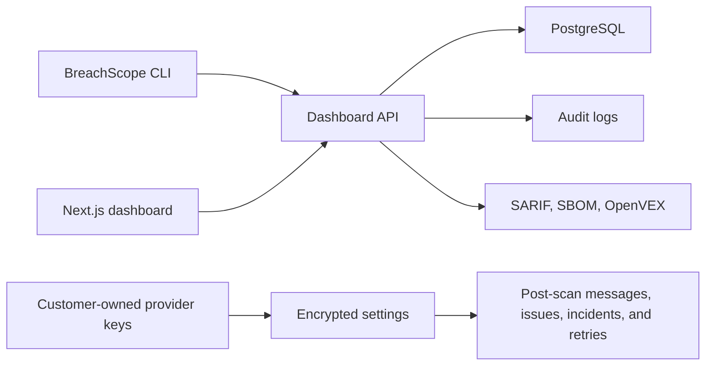

<div align="center">

# BreachScope

**Open-source security workflow for code, dependencies, SaaS posture, runtime evidence, release gates, and dashboard triage.**

[](LICENSE)
[](https://nodejs.org)

</div>

---

## What BreachScope Does

BreachScope is a local-first CLI and dashboard for finding security risk before it reaches production. It scans source code, dependency graphs, lockfiles, live URLs, SaaS toolchains, and Docker sandbox attack paths, then turns the results into release evidence: SARIF, SBOMs, OpenVEX, policy decisions, baselines, fix suggestions, triage fields, audit logs, and project dashboards.

It is built for teams that need both developer speed and governance:

- Developers get one command that works in any project.
- AppSec gets policy-as-code, baselines, SARIF, SBOM, OpenVEX, and audit trails.
- Platform teams get CI templates, scoped API keys, integrations, and runtime event capture.
- Security operations get triage, post-scan delivery status, retry history, and project-level evidence history.

---

## Quick Start

```bash
npm install -g breachscope

cd my-project
breachscope scan

# Full static coverage with CI failure behavior
breachscope scan --mode deep --breach --bug --ci

# Keep authenticated scan results local
breachscope scan --no-upload

# Inspect CVEs hidden from the default actionable report
breachscope scan --target dependency --all-cves --output json --file breachscope-full.json

# Docker attack arena
breachscope sandbox --deep
```

Both `breachscope` and `bs` are available after install.

---

## Core Capabilities

| Area | Capability |
| --- | --- |
| Dependency security | OSV matching across npm, PyPI, Go, crates.io, RubyGems, Maven, Packagist, NuGet, Hex, and Pub |
| Noise triage | Groups CVEs by package/fix path and classifies findings as show, review, or hide using exploitability, depth, VEX, EPSS, KEV, and evidence strength |
| Supply-chain scoring | Deterministic 0-100 risk score from CVEs, OpenSSF, deps.dev, maintainers, downloads, source audit hits, deprecation, and license metadata |
| Code audit | Mode-aware static patterns for secrets, injection, auth bypass, deserialization, SSRF, XSS, weak crypto, and more |
| Docker attack arena | Isolated app runtime with hardened Docker flags and active exploit probes |
| Live probes | Security headers, exposed paths, CORS, smoke checks, and toolchain API checks |
| Evidence outputs | Console, JSON, SARIF, CycloneDX, SPDX, OpenVEX, and Markdown fix briefs |
| Governance | Policy-as-code, baselines, expiring suppressions, thresholds, budgets, blocked packages |
| Dashboard | Projects, scoped API keys, policies, integrations, audit logs, scan history, triage fields |
| Identity foundations | Tenant-gated SCIM endpoints and SAML metadata with fail-closed ACS until IdP validation is configured |
| Runtime monitoring | Tracee/eBPF command for Linux runtime event collection |

---

## Scan Depth and Focus

### Depth

| Mode | What it scans | Speed |
| --- | --- | --- |
| `basic` | Direct tools and manifests | Fast |
| `major` | Direct tools plus first-level dependencies | Medium |
| `deep` | Recursive dependency graph up to configured depth | Thorough |

### Focus

| Flags | Mode | Focus |
| --- | --- | --- |
| none | `all` | Balanced dependency, code, toolchain, blackbox, and smoke coverage |
| `--breach` | `breach` | CVEs, hijacked packages, leaked credentials, exposed infrastructure |
| `--bug` | `bug` | Injection, auth bypass, deserialization, SSRF, XSS, logic bugs |
| `--breach --bug` | `full` | Maximum coverage across breach and bug classes |

---

## Finding Noise Triage

BreachScope keeps the default report focused on actionable findings. Low-signal CVEs, duplicate advisory aliases, weak probe observations, and browser-hardening notes are preserved in JSON metadata but hidden from console, SARIF, dashboard upload, and CI gates unless you ask for them.

- Use `--all-cves` to include CVE advisories hidden by default.
- Use `--show-noise` to include all review and hidden findings.
- Use `--llm-triage` to let the configured LLM add reasoning for borderline findings. Deterministic guardrails prevent it from hiding confirmed exploit, CISA KEV, high EPSS, direct high/critical dependency, or confirmed sensitive-exposure findings.

---

## Release And Evidence Commands

```bash
# SARIF for GitHub Advanced Security or other code-scanning platforms
breachscope scan --ci --output sarif --file breachscope.sarif

# Create and enforce a baseline
breachscope scan --write-baseline breachscope-baseline.json
breachscope scan --baseline breachscope-baseline.json --new-findings-only --ci

# Apply policy-as-code
breachscope scan --policy release-gate.yml --fail-on high --ci

# Export release evidence
breachscope sbom --output cyclonedx --file bom.cdx.json
breachscope sbom --output spdx --file bom.spdx.json
breachscope scan --output json --file scan.json
breachscope vex --from scan.json --file openvex.json
breachscope suggest-fixes --from scan.json --file fixes.md

# Generate CI workflows
breachscope init-ci

# Runtime monitoring on Linux hosts with Tracee installed
breachscope runtime --container my-container --duration 120 --file tracee-events.jsonl
```

---

## Supported Ecosystems

| Ecosystem | Files |
| --- | --- |
| JavaScript / TypeScript | `package.json`, `package-lock.json`, `yarn.lock`, `pnpm-lock.yaml` |
| Python | `requirements.txt`, `pyproject.toml`, `Pipfile`, `setup.py` |
| Go | `go.mod` |
| Rust | `Cargo.toml`, `Cargo.lock` |
| Ruby | `Gemfile`, `Gemfile.lock` |
| Java | `pom.xml`, `build.gradle`, `build.gradle.kts` |
| PHP | `composer.json`, `composer.lock` |
| .NET | `*.csproj`, `packages.lock.json` |
| Elixir | `mix.exs`, `mix.lock` |
| Dart | `pubspec.yaml`, `pubspec.lock` |

---

## Dashboard

The dashboard adds operational control around CLI scans:

- project-scoped scan history and findings
- scoped API keys: `scan:write`, `config:read`, `secrets:read`, `settings:write`
- project policies and audit logs
- integration records, provider-specific setup, delivery status, and retryable post-scan actions
- finding triage: status, assignee, due date, accepted-risk reason, suppression expiry, VEX status, compliance tags
- optional encrypted OpenAI and Firecrawl settings supplied by the user
- SCIM and SAML foundations for identity workflows, disabled unless explicitly configured

Apply the generated Drizzle migration before using the dashboard schema in production.

Provider accounts and credentials are customer-owned. BreachScope does not provide Slack, GitHub, Jira, Linear, PagerDuty, OpenAI, Firecrawl, cloud, or repository accounts.

## Architecture



---

## Security Defaults

- Scan upload payloads are size-limited and validated.
- CLI auth polling is replay-safe.
- CLI and CI can authenticate with `breachscope login` or `BREACHSCOPE_API_KEY`.
- API keys enforce scopes on scan upload and CLI config endpoints.
- Registration avoids account enumeration and enforces stronger passwords.
- Sandbox excludes `.env` files from model context, Docker context, and container env by default. Use `--include-secrets` only in disposable test environments.
- Distributed rate limiting can use Upstash Redis via `UPSTASH_REDIS_REST_URL` and `UPSTASH_REDIS_REST_TOKEN`.

---

## Documentation

- [Getting started](docs/getting-started.md)
- [Controls and evidence](docs/enterprise.md)
- [Architecture](docs/architecture.md)
- [Scan command](docs/commands/scan.md)
- [Sandbox command](docs/commands/sandbox.md)
- [Model-assisted analysis](docs/ai-agents.md)
- [Legal docs](docs/legal)
- [GitHub integration](docs/integrations/github.md)
- [Provider integrations](docs/integrations/providers.md)
- [Supabase integration](docs/integrations/supabase.md)
- [Vercel integration](docs/integrations/vercel.md)
- [Security policy](SECURITY.md)
- [Contributing](CONTRIBUTING.md)

---

## License

MIT. See [LICENSE](LICENSE).
