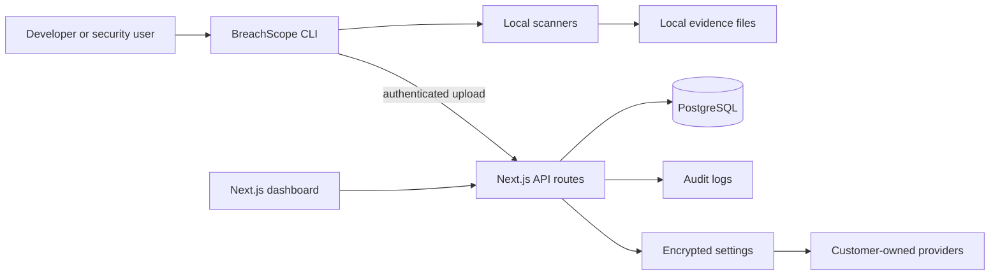
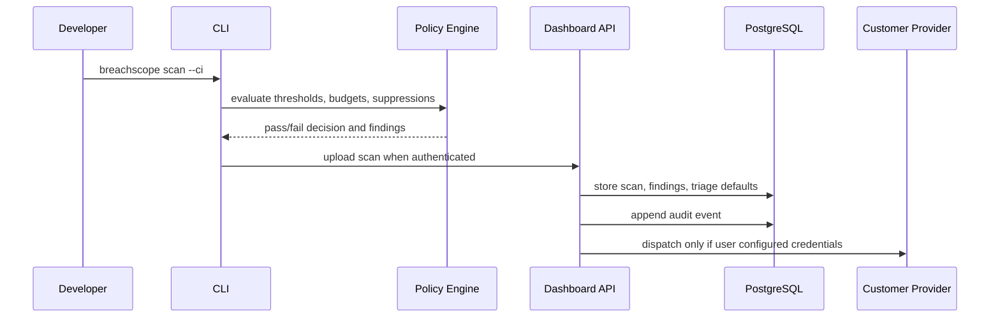
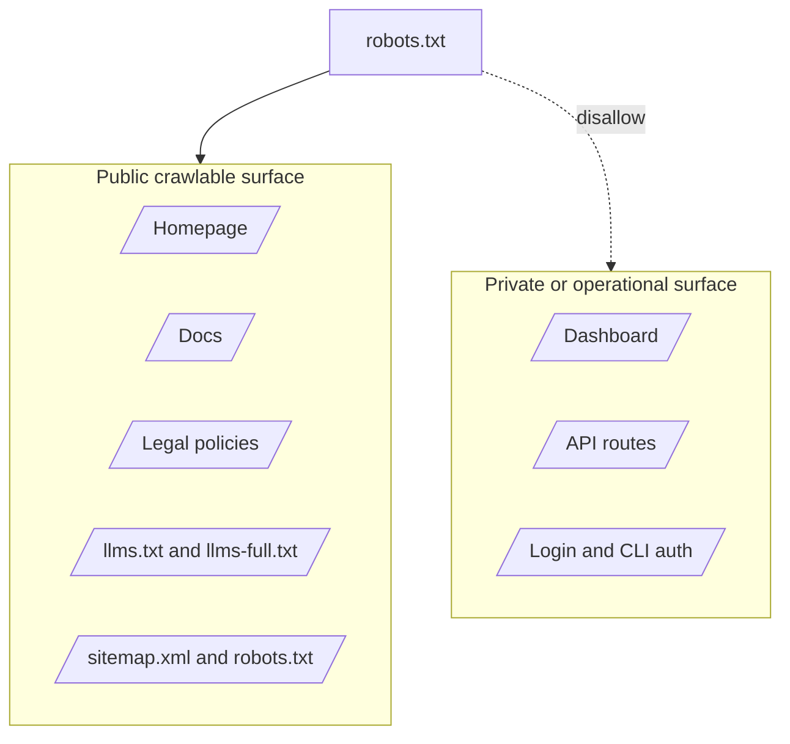

# Architecture

BreachScope is split into a local CLI, a Next.js dashboard, API routes, PostgreSQL storage, and optional customer-owned integrations.

## Runtime Overview

## Scan Pipeline

## Data Boundaries

## Credential Model

- BreachScope does not provide third-party provider accounts.
- Users bring provider accounts and tokens.
- Dashboard automation keys are scoped.
- Authentication keys are hashed where they are used for authentication.
- Saved provider keys are encrypted before storage.
- Secret retrieval requires an API key with `secrets:read`.
