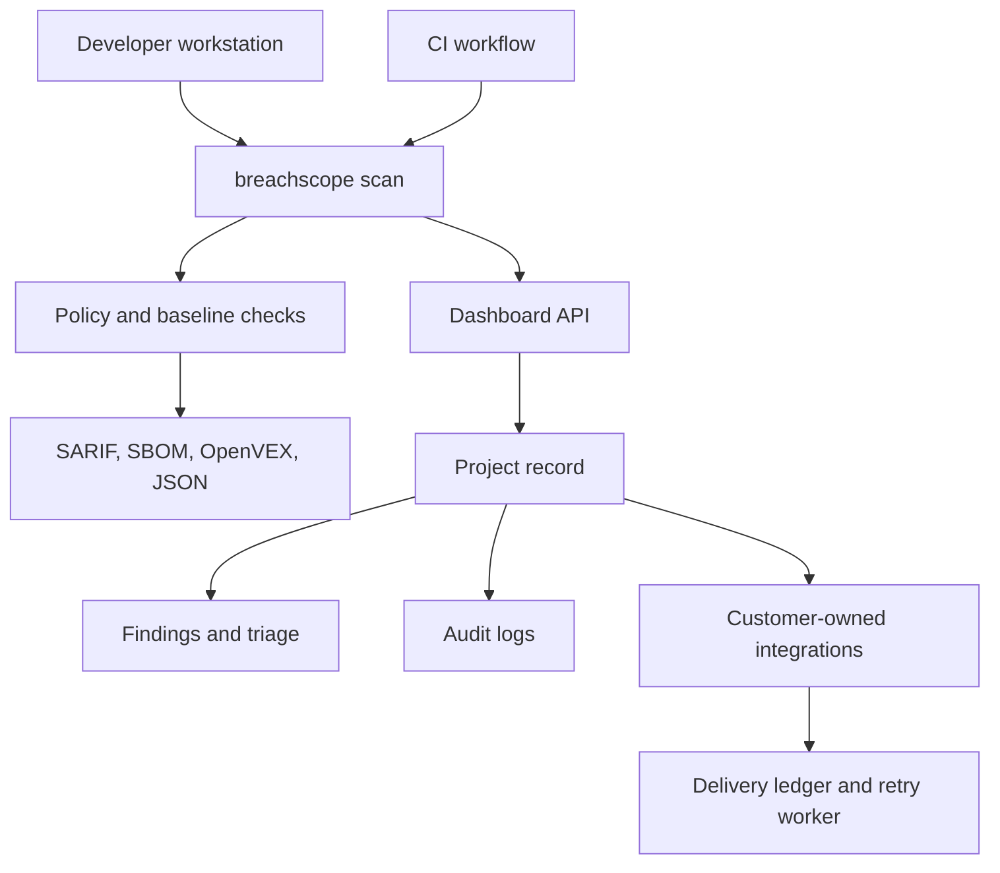

# Controls and Evidence

BreachScope connects local scans, CI gates, release evidence, dashboard triage, audit logs, scoped API keys, and customer-owned integrations.

## Control Flow



## CI Gates

```bash
breachscope scan --ci --fail-on high
breachscope scan --ci --policy release-gate.yml
breachscope scan --ci --baseline breachscope-baseline.json --new-findings-only
breachscope scan --write-baseline breachscope-baseline.json
```

## Policy-as-Code

Policies can live in `breachscope.yaml` or in a separate file passed with `--policy`.

```yaml
policy:
  failOn: high
  maxFindings:
    critical: 0
    high: 3
  blockedPackages:
    - event-stream
    - ua-parser-js
  deniedCategories:
    - compliance
  suppressions:
    - fingerprint: "64-character-finding-fingerprint"
      reason: "Accepted during migration"
      expiresAt: "2026-12-31T23:59:59Z"
      approvedBy: "security@example.com"
```

Suppressions must expire. Permanent suppressions should be handled as explicit accepted-risk triage records, not hidden policy bypasses.

## Baselines

Baselines let teams adopt the scanner without failing every build on legacy findings.

```bash
breachscope scan --write-baseline breachscope-baseline.json
breachscope scan --baseline breachscope-baseline.json --new-findings-only --ci
```

Findings are fingerprinted from stable attributes so renamed files and repeated scans remain manageable.

## Release Evidence

```bash
breachscope scan --output sarif --file breachscope.sarif
breachscope sbom --output cyclonedx --file bom.cdx.json
breachscope sbom --output spdx --file bom.spdx.json
breachscope scan --output json --file scan.json
breachscope vex --from scan.json --file openvex.json
breachscope suggest-fixes --from scan.json --file fixes.md
```

Supported SBOM ecosystems include npm, PyPI, Go, Cargo, RubyGems, Maven, Packagist, NuGet, Hex, and Pub.

## Deterministic Supply-Chain Scoring

The OSS pipeline computes a repeatable 0-100 risk score even when model-assisted synthesis is unavailable. Inputs include:

- OSV vulnerability matches
- OpenSSF Scorecard
- deps.dev score
- maintainer concentration
- weekly download blast radius
- recent releases
- suspicious source or lifecycle-script findings
- deprecation metadata
- risky or missing license metadata

The deterministic score is used as a floor for generated risk assessments, so a generated response cannot understate strong machine-detected risk signals.

## Dashboard Controls

The web application includes:

- organizations and organization memberships
- projects
- project-scoped API keys
- policy records
- customer-owned integrations with delivery status
- audit logs
- finding triage fields: status, assignee, due date, accepted-risk reason, suppression expiry, VEX status, compliance tags

Core endpoints:

| Endpoint | Purpose |
| --- | --- |
| `GET/POST /api/projects` | Project management |
| `GET/POST /api/policies?projectId=...` | Project policy management |
| `GET/POST /api/integrations?projectId=...` | Integration records |
| `PATCH/DELETE /api/integrations` | Update or remove integration records |
| `POST /api/integrations/test` | Test dispatch for a configured provider |
| `POST /api/integrations/github/audit` | Run GitHub repository and PR audit and save it as scan evidence |
| `GET /api/integration-deliveries?projectId=...` | Provider delivery status, external links, failures, and retry state |
| `GET/POST /api/jobs/integration-deliveries` | Retry due provider deliveries from Vercel Cron or an operator-run job |
| `GET /api/audit-logs?projectId=...` | Project audit trail |
| `PATCH /api/findings/:id/triage` | Finding status and risk workflow |
| `GET/POST /api/scim/v2/Users` | SCIM user lifecycle foundation |
| `PATCH/DELETE /api/scim/v2/Users/:id` | SCIM user update and deactivation |
| `GET /api/saml/metadata` | SAML metadata |
| `POST /api/saml/acs` | Fail-closed ACS until validation is configured |

## Scoped API Keys

Dashboard keys support least-privilege scopes:

| Scope | Allows |
| --- | --- |
| `scan:write` | Upload scan results |
| `config:read` | Read CLI defaults |
| `secrets:read` | Read encrypted customer-supplied provider keys |
| `settings:write` | Sync CLI default settings |

The CLI device-flow key gets `scan:write`, `config:read`, and `settings:write`. Secret read must be granted intentionally.

## Integrations

Post-scan delivery is project-scoped. When a scan lands on a project, BreachScope builds a finding summary, checks each integration's severity threshold, creates a delivery ledger row, sends the provider request, stores external links or errors, and schedules retries for transient failures.

Implemented provider workflows:

- GitHub repository audit, PR audit, optional issue creation, optional PR comments, and scan-triggered issue creation
- GitLab issue creation
- Bitbucket issue creation
- Jira issue creation with labels and severity-to-priority mapping
- Linear issue creation with team, project, labels, and priority
- Slack Block Kit notifications
- Microsoft Teams message cards
- PagerDuty Events API v2 incidents with deduplication keys

SAML and SCIM records remain identity configuration surfaces. They do not receive scan notifications.

## Runtime Monitoring

Linux environments with Tracee installed can collect runtime events:

```bash
breachscope runtime --container my-container --duration 120 --file tracee-events.jsonl
breachscope runtime --dry-run
```

Runtime output is JSONL so it can be archived with scan artifacts or ingested into security data lakes.

## Secret-Safe Sandbox

Sandbox scans exclude `.env` files from model context, Docker context, and container environment by default.

```bash
breachscope sandbox --include-secrets
```

Use `--include-secrets` only in disposable environments where active exploitation is intentional.

## Deployment Checklist

- Apply the generated Drizzle migration.
- Configure `ENCRYPTION_KEY`, auth secrets, and database URL.
- Configure `UPSTASH_REDIS_REST_URL` and `UPSTASH_REDIS_REST_TOKEN` for distributed rate limiting.
- Connect customer-owned provider credentials for Slack, Teams, PagerDuty, Jira, or Linear.
- Install Tracee on Linux hosts that use runtime monitoring.
- Configure SAML assertion validation and IdP certificate pinning before enabling SSO login.
