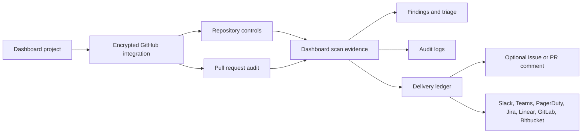

# GitHub Integration

BreachScope can connect a customer-owned GitHub repository to a dashboard project. The integration audits repository controls, branch protection, GitHub Actions posture, CODEOWNERS coverage, workflow pinning, and optional pull request risk.

## Required Inputs

| Field | Purpose |
| --- | --- |
| Repository | `owner/repo`, `https://github.com/owner/repo`, or `git@github.com:owner/repo.git` |
| Default branch | Branch used for protection, CODEOWNERS, and workflow checks |
| Token | Customer-owned fine-grained PAT or GitHub App installation token |

The token is encrypted before storage. The API never returns the token through integration reads.

## Recommended Token Permissions

For read-only audits:

| Permission | Access |
| --- | --- |
| Metadata | Read |
| Contents | Read |
| Pull requests | Read |
| Actions | Read |
| Administration | Read, if branch protection and repository security settings should be checked |

For delivery back to GitHub:

| Workflow | Permission |
| --- | --- |
| Create audit issue | Issues: write |
| Comment on audited PR | Pull requests: write or Issues: write, depending on token type and repository policy |

GitHub's REST API treats pull requests as issues for shared actions such as issue comments, labels, assignees, and milestones. BreachScope uses that model when posting a PR audit comment.

## Audit Pipeline

The generated dashboard scan includes:

- repository metadata and visibility posture
- default branch protection checks
- GitHub Actions token permission checks
- CODEOWNERS presence
- workflow dependency pinning checks
- stale pull request queue signals
- optional PR-specific checks for workflow, sensitive path, lockfile, test, and review-size risk
- optional AI synthesis when the user has configured an OpenAI key

## Dashboard Flow

1. Open `Dashboard -> Controls`.
2. Create or select a project with a GitHub repository URL.
3. Add a GitHub integration.
4. Enter a token owned by your GitHub account or organization.
5. Test the integration.
6. Run a repository audit, optionally with a PR number.
7. Open the generated dashboard scan for findings, probe activity, and report output.

Delivery back to GitHub is opt-in per audit run. Enable `Create GitHub issue` to open an issue with the summary. Enable `Comment on PR` when a pull request number is supplied.

Repository and PR audits are also saved as normal scans. That means the same project-level delivery pipeline can notify Slack or Teams, create Jira/Linear/GitLab/Bitbucket follow-up issues, and trigger PagerDuty for severe findings according to each integration's severity threshold.
