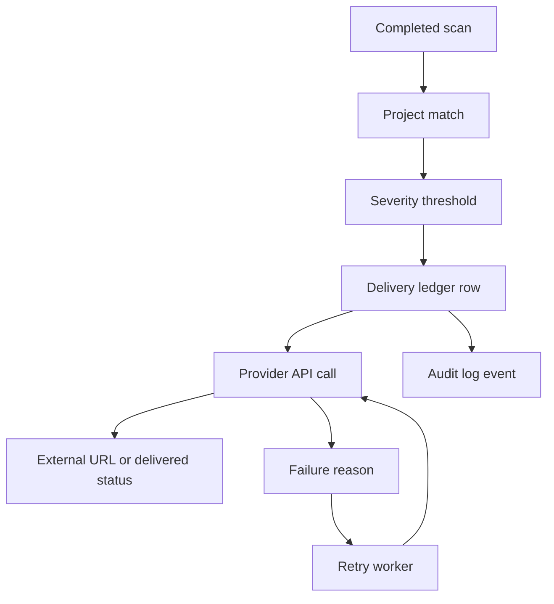

# Provider Integrations

BreachScope routes completed scans through project integrations. Provider accounts, tokens, webhooks, and incident keys are supplied by the customer.
Provider URLs must use HTTPS and cannot target localhost or private network addresses. Production deployments also validate DNS resolution before outbound provider requests.

## Delivery Flow



## Providers

| Provider | Workflow |
| --- | --- |
| GitHub | Repository/PR audit, optional PR comments, optional issue creation, scan-triggered issue creation |
| GitLab | Create issues in a GitLab.com or self-managed project |
| Bitbucket | Create issues in a Bitbucket Cloud repository |
| Jira | Create issues with project key, issue type, labels, and severity-based priority |
| Linear | Create issues with team, optional project, labels, and priority |
| Slack | Send Block Kit notifications to a customer-owned incoming webhook |
| Teams | Send message cards to a customer-owned incoming webhook or workflow URL |
| PagerDuty | Trigger Events API v2 incidents with a scan/severity deduplication key |

## Retry Model

Every live delivery creates an `integration_deliveries` row. Failed provider calls move to `retrying` until `max_attempts` is reached, then move to `failed`. The retry endpoint is:

```text
GET /api/jobs/integration-deliveries
Authorization: Bearer <CRON_SECRET>
```

On Vercel, configure a Cron job to call this endpoint every few minutes. In production, set `CRON_SECRET`; the route returns `503` without it.
