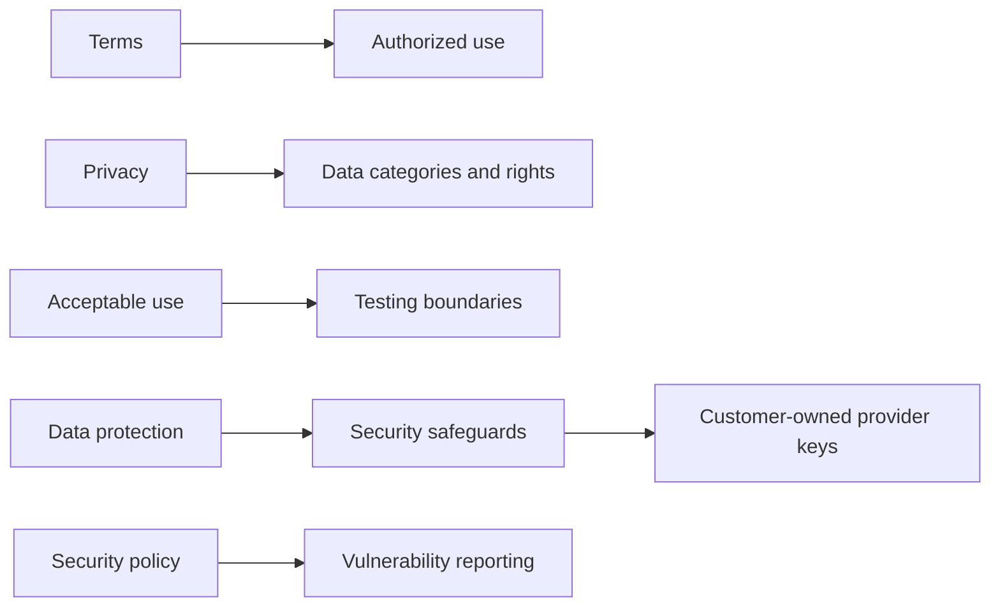

# Legal Documents

These documents mirror the public legal pages in the web app.

- [Terms](terms.md)
- [Privacy](privacy.md)
- [Acceptable use](acceptable-use.md)
- [Data protection](data-protection.md)
- [Security](security.md)

## Policy Map

